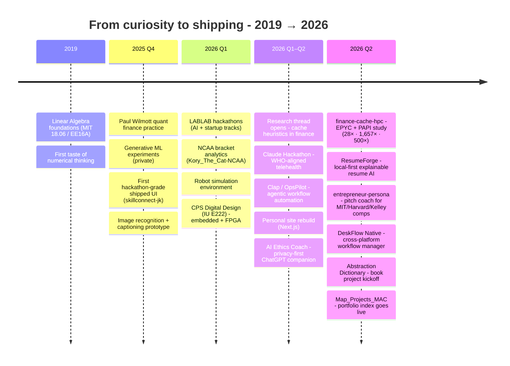

<!-- ═══════════════════════════════════════════════════════════════════════ -->
<!--  Profile README - pbathuri                                              -->
<!--  Assets served from github.com/pbathuri/Map_Projects_MAC/Assets/        -->
<!--  Auto-generated SVGs: Platane/snk + lowlighter/metrics (.github/wfs)    -->
<!-- ═══════════════════════════════════════════════════════════════════════ -->

<!-- ── Hero banner (animated GIF, static PNG fallback via object tag) -->

  

<!-- ── Typing headline ─────────────────────────────────────────────────── -->

 

<!-- ── Connect row ─────────────────────────────────────────────────────── -->

 

---

### About

I'm a **quantitative researcher and systems builder** working at the intersection of **high-performance computing, capital markets, and machine learning**. My focus is on what actually moves the needle at low-latency scale - cache behaviour of financial kernels, foundation models trained on market data, and the tooling layer around modern research workflows.

I'm drawn to problems where the maths, the hardware, and the market all have a vote. I build a lot. I read a lot. I ship the things I read about.

> Currently a researcher at **Indiana University - Luddy School of Informatics, Computing and Engineering**, focused on cache-aware numerical methods for quantitative finance.

---

### Research interests

<table>
<tr>
<td width="33%" valign="top">

#### 📊 Quant finance & HPC
Empirical cache characterisation of Monte Carlo, Cholesky, GARCH, and GEMM on EPYC / H100. PAPI counters, roofline, and what the hardware actually does under a pricing run.

</td>
<td width="33%" valign="top">

#### 🧠 Foundation models for markets
Transformer architectures on financial time series, compression-first training, and predictive pipelines that survive out-of-sample.

</td>
<td width="33%" valign="top">

#### 🛠️ Agentic systems & tooling
Codebase intelligence, structured retrieval, and the boring scaffolding that makes research repeatable - dataset ingestion, evaluation harnesses, reproducibility.

</td>
</tr>
</table>

---

### Stack

 

---

### Timeline - how I got here

The through-line: **learn by building, measure before tuning, ship the thing**. Every entry on that line is a public (or private-on-request) repo you can open today.

---

### 🔬 Currently working on

- [`finance-cache-hpc`](https://github.com/pbathuri/finance-cache-hpc) - L1 cache characterisation of four quant kernels on AMD EPYC using PAPI
- [`Research_HPC_QFinance_Cache`](https://github.com/pbathuri/Research_HPC_QFinance_Cache) - the broader research thread this sits inside
- [`QuantumMCL-Spring26`](https://github.com/pbathuri/QuantumMCL-Spring26) - *(private)* heuristic cache mechanisms for finance workflows
- [`ResumeForge`](https://github.com/pbathuri/ResumeForge) - local-first, explainable resume tailoring with LaTeX + Overleaf sync

---

### Selected work

<table>
<tr><th align="left">Area</th><th align="left">Project</th><th align="left">What it does</th></tr>

<tr><td rowspan="3"><b>🔬 Quant & HPC research</b></td>
<td><a href="https://github.com/pbathuri/finance-cache-hpc">finance-cache-hpc</a></td>
<td>Empirical L1 cache study of Cholesky · Monte Carlo · GARCH · GEMM on EPYC · PAPI counters</td></tr>
<tr><td><a href="https://github.com/pbathuri/Research_HPC_QFinance_Cache">Research_HPC_QFinance_Cache</a></td><td>Research notes & experiments on improving cache behaviour in finance workflows</td></tr>
<tr><td><a href="https://github.com/pbathuri/Quantitative-Modeling_Practice">Quantitative-Modeling_Practice</a></td><td>Wilmott-style quant modelling - binomial pricing, risk-neutral valuation</td></tr>

<tr><td rowspan="4"><b>🧠 ML systems</b></td>
<td><a href="https://github.com/pbathuri/ResumeForge">ResumeForge</a></td>
<td>Local-first explainable resume tailoring · LangGraph · LaTeX · Overleaf sync</td></tr>
<tr><td><a href="https://github.com/pbathuri/Claude_Hackathon">Claude_Hackathon</a></td><td>WHO-aligned telehealth intake with a self-evolving medical knowledge graph</td></tr>
<tr><td><a href="https://github.com/pbathuri/convo-ai">convo-ai</a></td><td>Duolingo-style conversation practice - Next.js + Streamlit</td></tr>
<tr><td><a href="https://github.com/pbathuri/ai-ethics-coach">ai-ethics-coach</a></td><td>Privacy-first Chrome extension - prompt coach, response auditor, energy awareness</td></tr>

<tr><td rowspan="2"><b>🎯 Entrepreneurship</b></td>
<td><a href="https://github.com/pbathuri/entrepreneur-persona-skill">entrepreneur-persona-skill</a></td>
<td>AI pitch coach - 75+ judge Qs, 8 verticals, Clapp-style proposals, 12-slide decks</td></tr>
<tr><td><a href="https://github.com/pbathuri/entrepreneur-persona-llm">entrepreneur-persona-llm</a></td><td>Model-agnostic version - ChatGPT / Gemini / Cursor / Copilot / Claude</td></tr>

<tr><td rowspan="2"><b>🏆 Hackathons & competitions</b></td>
<td><a href="https://github.com/pbathuri/LABLAB-Hackathon">LABLAB-Hackathon</a></td>
<td>Captain Whiskers - AI trading agent</td></tr>
<tr><td><a href="https://github.com/pbathuri/Kory_The_Cat-NCAA">Kory_The_Cat-NCAA</a></td><td>NCAA bracket modelling · tiered ensemble + Hungarian assignment</td></tr>

<tr><td rowspan="2"><b>🖥️ Systems & embedded</b></td>
<td><a href="https://github.com/pbathuri/deskflow-native">deskflow-native</a> 🔒</td>
<td>Cross-platform (macOS + Windows) workflow manager - named profiles, non-destructive shortcuts</td></tr>
<tr><td><a href="https://github.com/pbathuri/CPS-Digital-Design">CPS-Digital-Design</a></td><td>IU E222 coursework - Raspberry Pi sensors, MQTT, SystemVerilog FPGA</td></tr>

</table>

🔒 = private, available on request · full index → <a href="https://github.com/pbathuri/Map_Projects_MAC">Map_Projects_MAC</a>

---

### Activity & metrics

<!-- ── Lowlighter metrics - auto-generated by .github/workflows/metrics.yml ── -->

 

 

<!-- ── Stats triptych ───────────────────────────────────────────────────── -->

 

 

<!-- ── Snake activity graph - auto-generated by .github/workflows/snake.yml ── -->

 

---

### Reading list (what's on my desk right now)

<table>
<tr><td><b>HPC / microarchitecture</b></td><td>Jim Handy - <i>The Cache Memory Book</i> · Balasubramonian & Jouppi - <i>Multi-Core Cache Hierarchies</i> · AMD EPYC architecture manuals</td></tr>
<tr><td><b>Quant finance</b></td><td>Velu, Hardy, Nehren - <i>Algorithmic Trading and Quantitative Strategies</i> (Chapman & Hall) · Wilmott - <i>Quantitative Finance</i> · Ruppert - <i>Statistics and Data Analysis for Financial Engineering</i></td></tr>
<tr><td><b>ML & systems</b></td><td>Fregly - <i>AI Systems Performance Engineering</i> · ISLR · deep-dive papers on KV-cache, flash attention, speculative decoding</td></tr>
</table>

---

### Philosophy

> *Curiosity is the unit. Everything else - papers read, kernels tuned, repos shipped - is just accumulated interest on it.*

I think the best researchers are the ones who can also build, and the best builders are the ones who read the papers. I try to be useful on both sides of that line.

---

Browse the full map → <a href="https://github.com/pbathuri/Map_Projects_MAC"><b>Map_Projects_MAC</b></a> · Assets → <a href="https://github.com/pbathuri/Map_Projects_MAC/tree/main/Assets"><b>/Assets</b></a>

